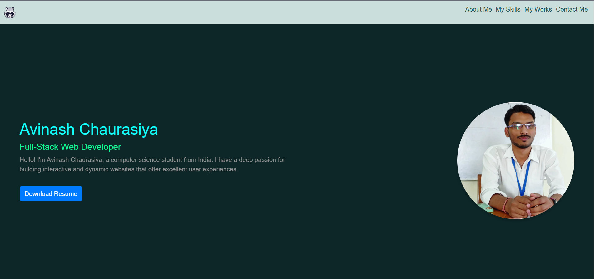
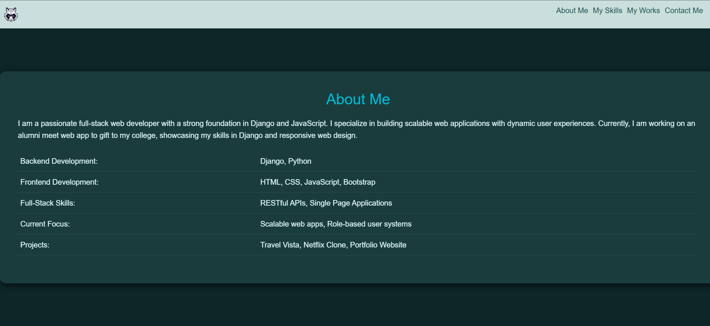
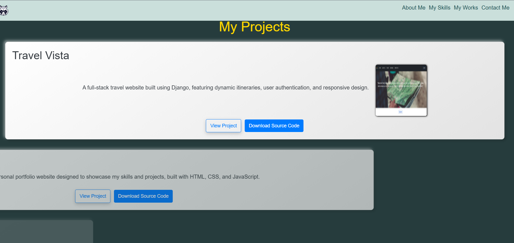
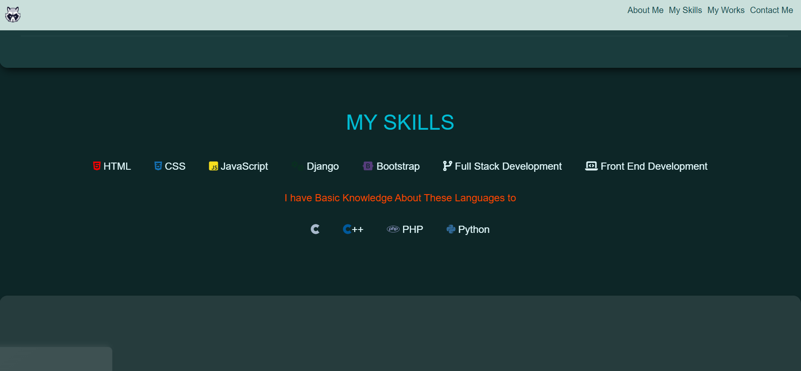
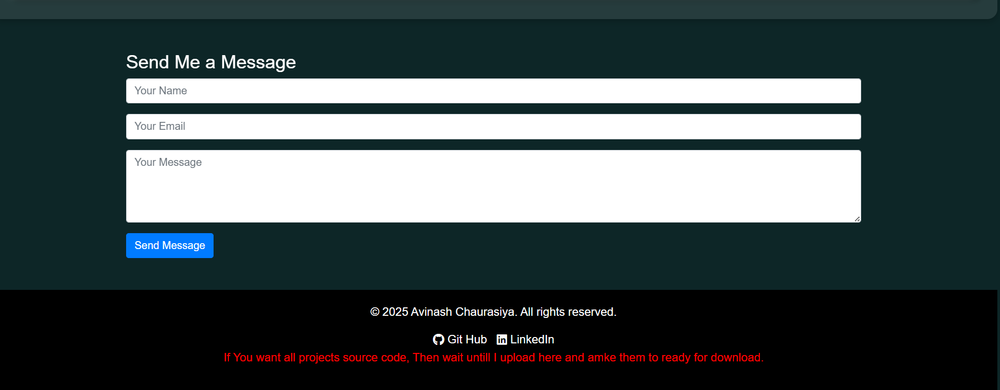

# My-Portfolio 🌟

This is an open-source Portfolio Website Template that I originally designed for myself. However, I later decided to share it with the world to help others showcase their skills, projects, and personality! Whether you're a developer, designer, or any creative, this template will help you shine online. ✨

---

✨ Features

🎨 Modern Design: Beautiful gradients and clean layout for an impressive first impression.
⚡ Responsive: Works flawlessly across all devices—mobile, tablet, and desktop.
🚀 Lightweight: Fast and efficient, no unnecessary bloat.
🛠️ Customizable: Easy to edit HTML, CSS, and JavaScript to suit your style.
📂 Project Showcase: Highlight your best work with a dedicated projects section.
💼 About Me: A creative space to tell your story.
📞 Contact Form: Let others reach out to you effortlessly.

---

🎯 Usage

1. Clone the repository:

```bash
git clone <https://github.com/webdevavi96/My-Portfolio.git>

2. Navigate to the project folder:

cd My-Portfolio

3. Open index.html in your browser to preview.

4. Customize the content in the HTML and CSS files to match your style.

```
---

🌟 Contributing

Contributions are always welcome! If you have ideas or improvements, feel free to fork the project and submit a pull request.


---

📜 License

This project is open-source under the MIT License.


---

🌟 Preview










---

Let's build something amazing together! 🌟

